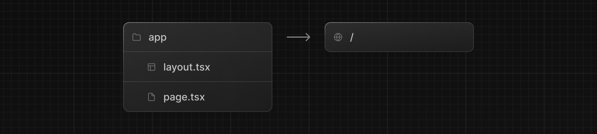

系统要求：

- 需要[Node.js 18.17](https://nodejs.org/)或更高版本。
- 支持macOS、Windows（包括WSL）和Linux。

## 自动安装

我们推荐使用[`create-next-app`](/docs/app/api-reference/create-next-app)来开始一个新的Next.js应用程序，它会自动为您设置一切。要创建一个项目，请运行：

```bash filename="Terminal"
npx create-next-app@latest
```

在安装过程中，您将看到以下提示：

```txt filename="Terminal"
What is your project named? my-app
Would you like to use TypeScript? No / Yes
Would you like to use ESLint? No / Yes
Would you like to use Tailwind CSS? No / Yes
Would you like to use `src/` directory? No / Yes
Would you like to use App Router? (recommended) No / Yes
Would you like to customize the default import alias (@/*)? No / Yes
What import alias would you like configured? @/*
```

在提示之后，`create-next-app`将创建一个以您的项目名称命名的文件夹，并安装所需的依赖项。

> **补充**：
>
> - Next.js现在默认提供了[TypeScript](/docs/app/building-your-application/configuring/typescript)、[ESLint](/docs/app/building-your-application/configuring/eslint)和[Tailwind CSS](/docs/app/building-your-application/styling/tailwind-css)的配置。
> - 您可以选择在项目的根目录中使用[`src`目录](/docs/app/building-your-application/configuring/src-directory)来将应用程序的代码与配置文件分开。

## 手动安装

要手动创建一个新的Next.js应用程序，请安装所需的软件包：

```bash filename="Terminal"
npm install next@latest react@latest react-dom@latest
```

打开您的`package.json`文件并添加以下脚本：

```json filename="package.json"
{
  "scripts": {
    "dev": "next dev",
    "build": "next build",
    "start": "next start",
    "lint": "next lint"
  }
}
```

这些脚本对应于应用程序开发的不同阶段：

- `dev`：运行[`next dev`](/docs/app/api-reference/next-cli#development)以启动Next.js的开发模式。
- `build`：运行[`next build`](/docs/app/api-reference/next-cli#build)以构建用于生产环境的应用程序。
- `start`：运行[`next start`](/docs/app/api-reference/next-cli#production)以启动Next.js的生产服务器。
- `lint`：运行[`next lint`](/docs/app/api-reference/next-cli#lint)以设置Next.js内置的ESLint配置。

### 创建目录

Next.js使用文件系统路由，这意味着应用程序中的路由由文件的结构决定。

#### `app`目录

对于新应用程序，我们建议使用[App Router](/docs/app)。该路由器允许您使用React的最新功能，并且是基于社区反馈的[Pages Router](/docs/pages)的进化版本。

创建一个`app/`文件夹，然后添加`layout.tsx`和`page.tsx`文件。当用户访问您应用程序的根目录（`/`）时，它们将被渲染。



在`app/layout.tsx`文件中创建一个带有所需`<html>`和`<body>`标签的[根布局](/docs/app/building-your-application/routing/pages-and-layouts#root-layout-required)：

```tsx filename="app/layout.tsx" switcher
export default function RootLayout({
  children,
}: {
  children: React.ReactNode
}) {
  return (
    <html lang="en">
      <body>{children}</body>
    </html>
  )
}
```

最后，在`app/page.tsx`文件中创建一个带有一些初始内容的首页：

```tsx filename="app/page.tsx" switcher
export default function Page() {
  return <h1>Hello, Next.js!</h1>
}
```

> **补充**：如果您忘记创建`layout.tsx`，Next.js将在使用`next dev`运行开发服务器时自动创建此文件。

了解更多关于[使用App Router](/docs/app/building-your-application/routing/defining-routes)的信息。

#### `pages`目录（可选）

如果您喜欢使用Pages Router而不是App Router，您可以在项目的根目录下创建一个`pages/`目录。

然后，在`pages`文件夹中添加一个`index.tsx`文件。这将成为您的首页（`/`）：

```tsx filename="pages/index.tsx" switcher
export default function Page() {
  return <h1>Hello, Next.js!</h1>
}
```

接下来，在`pages/`中添加一个`_app.tsx`文件，以定义全局布局。了解更多关于[自定义App文件](/docs/pages/building-your-application/routing/custom-app)的信息。

```tsx filename="pages/_app.tsx" switcher
import type { AppProps } from 'next/app'

export default function App({ Component, pageProps }: AppProps) {
  return <Component {...pageProps} />
}
```

最后，在`pages/`中添加一个`_document.tsx`文件，以控制服务器的初始响应。了解更多关于[自定义Document文件](/docs/pages/building-your-application/routing/custom-document)的信息。

```tsx filename="pages/_document.tsx" switcher
import { Html, Head, Main, NextScript } from 'next/document'

export default function Document() {
  return (
    <Html>
      <Head />
      <body>
        <Main />
        <NextScript />
      </body>
    </Html>
  )
}
```

了解更多关于[使用Pages Router](/docs/pages/building-your-application/routing/pages-and-layouts)的信息。

> **补充**：虽然您可以在同一个项目中同时使用这两个路由器，但`app`中的路由将优先于`pages`。我们建议在新项目中只使用一个路由器，以避免混淆。

#### `public`文件夹（可选）

创建一个`public`文件夹，用于存储静态资产，如图像、字体等。`public`目录中的文件可以通过从基本URL（`/`）开始引用来使用。

## 运行开发服务器

1. 运行`npm run dev`以启动开发服务器。
2. 访问`http://localhost:3000`以查看您的应用程序。
3. 编辑`app/page.tsx`（或`pages/index.tsx`）文件并保存，以在浏览器中看到更新后的结果。
